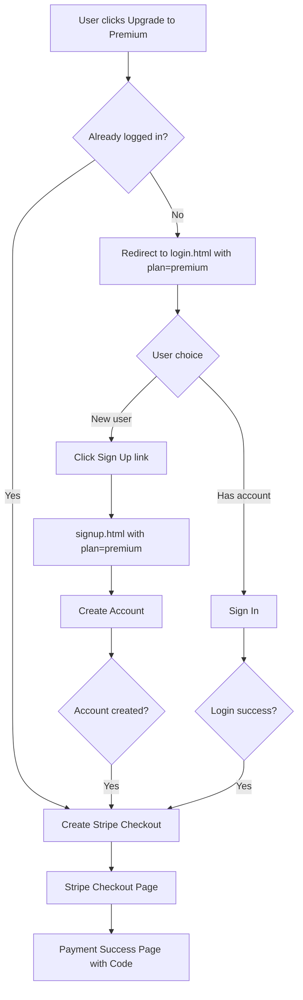

# Fix Authentication Flow

Three issues to address:
1. Signup shows "Check your email" message and doesn't redirect
2. User should be redirected to checkout after signup (for premium plan)
3. Users clicking "Upgrade to Premium" should see both sign-in and sign-up options

---

## Supabase Configuration (Manual Step)

Before code changes, disable email confirmation in Supabase:

1. Go to [Supabase Dashboard](https://supabase.com/dashboard) -> Your Project
2. Navigate to **Authentication** -> **Providers** -> **Email**
3. Toggle **"Confirm email"** to **OFF**
4. Click **Save**

This ensures users are immediately signed in after signup (no email verification needed).

---

## Code Changes

### 1. Fix Signup Redirect in [web/signup.html](web/signup.html)

The current code checks `confirmed_at` and shows an email message. With confirmation disabled, we should always redirect:

**Current code (lines 359-371):**
```javascript
if (data.user && !data.user.confirmed_at) {
  showMessage('Check your email to confirm your account!', 'success');
} else {
  showMessage('Account created! Redirecting...', 'success');
  // redirect logic
}
```

**Change to:**
```javascript
// With email confirmation disabled, user is auto-signed-in
// Check if we have a session (user is signed in)
const { data: sessionData } = await supabaseClient.auth.getSession();
if (sessionData.session) {
  showMessage('Account created! Redirecting to checkout...', 'success');
  setTimeout(() => {
    if (plan === 'premium') {
      // Redirect to Stripe checkout
      startCheckout(sessionData.session.user.email);
    } else {
      window.location.href = '/dashboard.html';
    }
  }, 1000);
} else {
  // Fallback message (shouldn't happen with confirmation disabled)
  showMessage('Account created! Please sign in to continue.', 'success');
  setTimeout(() => {
    window.location.href = '/login.html';
  }, 1500);
}
```

Add a `startCheckout()` function that calls the `/api/create-checkout` endpoint.

### 2. Update Pricing Page Flow in [web/pricing.html](web/pricing.html)

Instead of redirecting directly to signup, show a modal or redirect to an auth page with both options.

**Option A: Simple approach** - Redirect to login page with a message that they can sign up there

Change line 335 from:
```javascript
window.location.href = '/signup.html?plan=premium';
```

To:
```javascript
window.location.href = '/login.html?plan=premium&action=upgrade';
```

### 3. Update Login Page in [web/login.html](web/login.html)

Modify login page to:
- Accept `?plan=premium` parameter
- Show a prominent "Need an account? Sign up" link
- After successful login with `?plan=premium`, redirect to checkout instead of dashboard

**Changes:**
- Add parameter detection for `plan=premium`
- Show a banner when `plan=premium` is present: "Upgrade to Premium - Sign in or create an account"
- Change redirect after login to `/api/create-checkout` flow when plan=premium
- Make "Don't have an account? Sign up" more prominent

### 4. Update Signup Page in [web/signup.html](web/signup.html)

Add a more prominent sign-in option at the top for users who already have accounts:

**Add above the form:**
```html
<div class="auth-options" style="display: flex; gap: 10px; margin-bottom: 1.5rem;">
  <a href="/login.html?plan=premium" class="btn btn-secondary" style="flex:1;">Sign In</a>
  <button class="btn btn-primary active" style="flex:1; pointer-events:none;">Create Account</button>
</div>
```

---

## Flow Diagram



---

## Summary of File Changes

| File | Change |
|------|--------|
| [web/signup.html](web/signup.html) | Fix redirect logic after signup, add checkout function, add sign-in option |
| [web/login.html](web/login.html) | Add `plan` parameter handling, redirect to checkout after login for premium |
| [web/pricing.html](web/pricing.html) | Change redirect to login.html instead of signup.html |