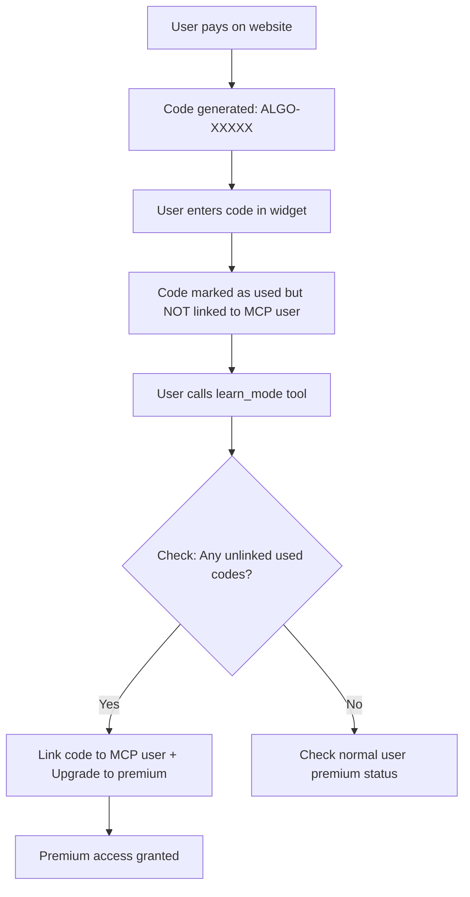

# Fix Premium Activation - User Identity Mismatch

## Root Cause Analysis

The premium activation fails because of an **IP mismatch**:

1. **Activation request**: Widget makes direct HTTP call to `/api/activate-premium`
   - IP source: User's browser or ChatGPT frontend server
   - Example: `subnet-73.xxx.xxx` (user's real IP)

2. **Tool usage request**: OpenAI MCP infrastructure calls tools
   - IP source: OpenAI's proxy servers
   - Example: `subnet-20.168.7` (OpenAI's proxy)

These are **different IPs**, so premium activated for IP A doesn't apply to tool calls from IP B.

---

## Solution: Code-Based Premium Linking

Instead of trying to match IPs, we'll use the premium code itself to bridge the gap:



---

## Implementation Steps

### Step 1: Update premium_codes table schema

Add a new column to track if the code has been linked to an MCP user:

```sql
ALTER TABLE premium_codes ADD COLUMN mcp_user_id TEXT;
```

Or run in Supabase SQL editor:
- `mcp_user_id`: The subnet-based user ID from tool calls (null until linked)

### Step 2: Modify `/api/activate-premium` endpoint

When a code is activated from the widget:
- Mark code as `used = true`
- Do NOT try to upgrade a user (we don't know the MCP user yet)
- Return success message

Changes in [server.js](server.js):
- Remove the user creation/update logic from activate-premium
- Just mark the code as used and return success

### Step 3: Modify `authenticateRequest` in auth.js

After getting/creating the user, add a new step:
- If user is NOT premium, check for any `premium_codes` where:
  - `used = true`
  - `mcp_user_id IS NULL` (not yet linked)
- If found, link the code to this user and upgrade them to premium

Changes in [auth.js](auth.js):
- Add a new function `linkPendingPremiumCode(user)`
- Call it in `authenticateRequest` before checking usage limits

### Step 4: Update Supabase schema

Either manually add the column or update [supabase-setup.sql](supabase-setup.sql).

---

## Detailed Code Changes

### auth.js - Add premium code linking function

```javascript
async function linkPendingPremiumCode(user) {
  // Check if user is already premium
  if (user.subscription_tier === 'premium') return user;
  
  // Look for any used but unlinked premium code
  const { data: pendingCode } = await supabase
    .from('premium_codes')
    .select('*')
    .eq('used', true)
    .is('mcp_user_id', null)
    .order('used_at', { ascending: false })
    .limit(1)
    .single();
  
  if (pendingCode) {
    // Link code to this user
    await supabase
      .from('premium_codes')
      .update({ mcp_user_id: user.chatgpt_user_id })
      .eq('id', pendingCode.id);
    
    // Upgrade user to premium
    await supabase
      .from('users')
      .update({ subscription_tier: 'premium', subscription_status: 'active' })
      .eq('id', user.id);
    
    user.subscription_tier = 'premium';
    console.log('[Auth] Linked premium code to user:', user.chatgpt_user_id);
  }
  
  return user;
}
```

### server.js - Simplify activate-premium endpoint

Remove user creation/update logic - just mark code as used.

---

## Summary of Changes

| File | Change |
|------|--------|
| Supabase | Add `mcp_user_id` column to `premium_codes` table |
| [auth.js](auth.js) | Add `linkPendingPremiumCode()` function, call in `authenticateRequest` |
| [server.js](server.js) | Simplify `/api/activate-premium` to only mark code as used |